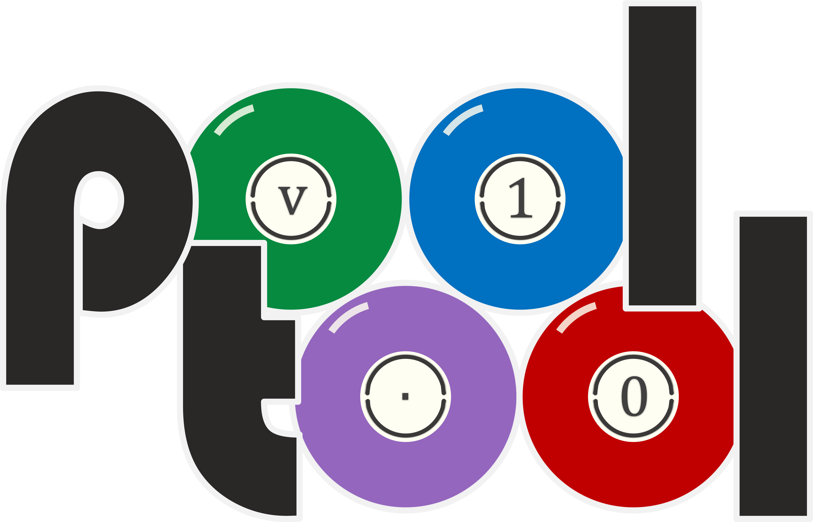

# Intro

*pooltool* is a sandbox billiards game that emphasizes realistic physics. You can play any form of billiards, experiment with different physics settings, or you use the API to investigate billiards-related research questions. Keep reading for an intro into the topic or **scroll down for posts of this blog series**.

# This project is in pre-alpha

Use at your own risk.

# Blog

A blog dedicated to the development of this project can be found on [my website](https://ekiefl.github.io/projects/pooltool/).
