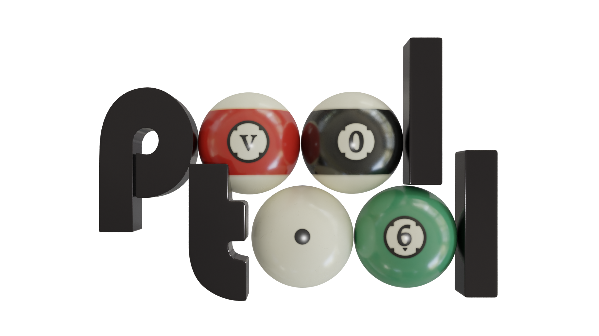

# Intro

*pooltool* is a sandbox billiards game that emphasizes realistic physics. You can play different types of billiards, experiment with different physics settings, or you can use the API to investigate billiards-related research questions.

# Gallery


# Blog

I have blogged about every aspect of this project. Read the detailed account [here](https://ekiefl.github.io/projects/pooltool/).

# OS support

This project is very much a work-in-progress. Your OS may have partially supported or untested support. The following shows what is known to work.

|        | MacOS | Windows | Linux |
|--------|-------|---------|-------|
| API    | ✅    | ✅      | 🔶    |
| GUI    | ✅    | ❌      | 🔶    |
| pip    | ✅    | ✅      | 🔶    |

✅ = works
❌ = doesn't work
🔶 = untested

# Installation

Installation instructions vary depending on how you want to interact with pooltool. There are 3 current options: _(1) Installer_, _(2) PIP_, and _(3) Developer_. Click on the following options to pull up descriptions and instructions for each installation method.

<details><summary">Install option (1): Installer</summary>

**NOTE**: I haven't sorted out this step yet, but eventually there will be OS-specific installers available for download here. Until then, please follow the PIP or Developer instructions below.

| Method    | GUI | API | Develop |
|-----------|-----|-----|---------|
| Installer | ✅  | ❌  | ❌      |

This is by far the easiest option. If you want to play and experiment with billiards using the graphical user interface (GUI), this option is for you. You won't have access to the python API, or be able to edit the source code. In other words, this is the non-coding option.

</details>

<details><summary>Install option (2): PIP</summary>

| Method    | GUI | API | Develop |
|-----------|-----|-----|---------|
| PIP       | ✅  | ✅  | ❌      |

This installation uses `pip`. With this option, you have access to the python API so that you can code up billiards simulations. You also have command-line access to the GUI.

Pooltool is incompatible with Python <3.8 and has been tested with the following versions:

- Python 3.8.10 (default, May 19 2021, 11:01:55)
- Python 3.9.0 (default, Nov 15 2020, 06:25:35)
- Python 3.10.0 (default, Nov 10 2021, 11:24:47) [Clang 12.0.0 ] on darwin

With a compatible python version, install via

```python
pip install pooltool-billiards
```

After installing, the GUI can be opened at any time via

```bash
run_pooltool
```

Or, if you're on Windows:

```bash
run_pooltool.bat
```

You can also use the API. Here is a small python script that runs a shot simulation and then visualizes the results.

```python
#! /usr/bin/env python

import pooltool as pt

# Start an instance of the ShotViewer
interface = pt.ShotViewer()

# We need a table, some balls, and a cue stick
table = pt.Table.default()
balls = pt.get_nine_ball_rack(table, ordered=True)
cue = pt.Cue(cue_ball_id="cue")

# Wrap it up as a System
shot = pt.System(table=table, balls=balls, cue=cue)

# Aim at the head ball then strike the cue ball
shot.aim_at_ball("1")
shot.strike(V0=8)

# Evolve the shot. This modifies the system in-place
pt.simulate(shot)

# Open up the shot in the GUI
interface.show(shot)
```

I haven't spent much time on the API yet but hopefully you get the idea.

</details>

<details><summary>Install option (3): Developer</summary>

| Method    | GUI | API | Develop |
|-----------|-----|-----|---------|
| Developer | ✅  | ✅  | ✅      |

If you want to develop for pooltool, have access to the most up-to-date version of the codebase, or modify the code to your liking, this is for you.

A small note. If you don't have the ability to create isolated python environments, I would recommend installing `conda` ([here](https://conda.io/projects/conda/en/latest/user-guide/install/index.html)) so you can isolate pooltool from your other business.

**(i)** create a new, python environment that uses Python 3.8.10.

With `conda`, you could do the following:

```bash
conda deactivate
conda env remove --name pooltool
conda create -y -n pooltool python=3.8.10
conda activate pooltool
```

Regardless of how you managed your python environment, please verify you're running `3.8.10`

```
$ python
Python 3.8.10 (default, May 19 2021, 11:01:55)
[Clang 10.0.0 ] :: Anaconda, Inc. on darwin
Type "help", "copyright", "credits" or "license" for more information.
>>> exit()
```

**(ii)** grab the codebase:

```bash
cd <A_DIRECTORY_YOU_LIKE>
git clone https://github.com/ekiefl/pooltool.git
cd pooltool
```

**(iii)** install the dependencies:

```bash
pip install -r requirements.txt
pip install -r requirements-dev.txt
```

In addition to `requirements.txt`, `requirements-dev.txt` includes some modules required for developement.

**(iv)** test out your installation:

```bash
python run_pooltool
```

The game window should appear (escape key to exit).

**(v)** if you used a conda environment that you named `pooltool`, create this script that runs whenever the conda environment is activated. This script modifies `$PATH` and `$PYTHONPATH` so that python knows where to find pooltool libraries and the shell knows where to find the pooltool binary. **These path modifications live safely inside the pooltool conda environment, and do not propagate into your global
environment**:

(_This is a multi-line command. Paste the entire block into your command line prompt._)

```
mkdir -p ${CONDA_PREFIX}/etc/conda/activate.d
cat <<EOF >${CONDA_PREFIX}/etc/conda/activate.d/pooltool.sh
export PYTHONPATH=\$PYTHONPATH:$(pwd)
export PATH=\$PATH:$(pwd)
EOF
```

The next time you activate your conda environment (`conda activate pooltool`), `run_pooltool` (or `run_pooltool.bat` if you're on Windows) is now a binary that can be run anywhere in your filesystem whenever you are in the `pooltool` conda environment. Test it out:

```
conda activate pooltool
cd ~
run_pooltool
```

</details>

## Tutorials

There are some tutorials for pooltool that can be viewed in [the wiki](https://github.com/ekiefl/pooltool/wiki).

## Support

You can buy me a coffee if this project was helpful to you.

[](https://www.buymeacoffee.com/kieflevan)
