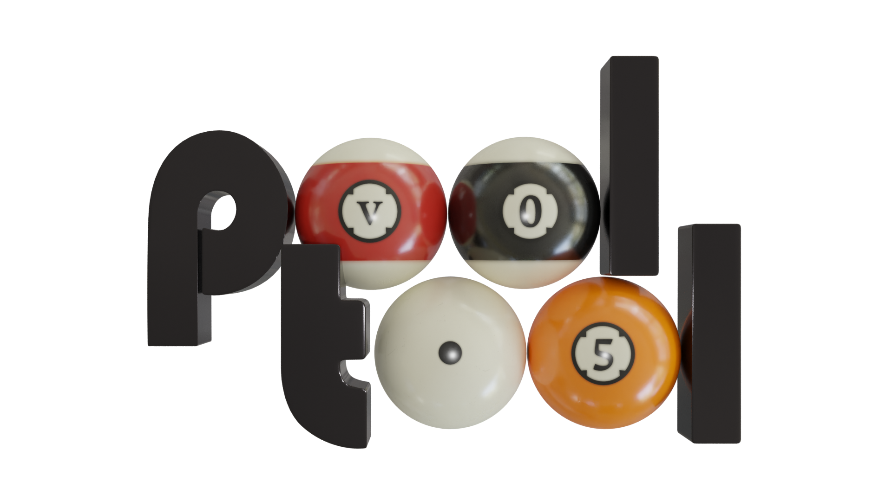

# Intro

*pooltool* is a sandbox billiards game that emphasizes realistic physics. You can play any form of billiards, experiment with different physics settings, or you use the API to investigate billiards-related research questions.

# Gallery


# Blog

I have blogged about every aspect of this project. Read the detailed account [here](https://ekiefl.github.io/projects/pooltool/).

# Installation

Here is how to install pooltool

## Users

Creating OS-specific installers is on my to do list for the alpha release. Until then, please follow the developer instructions.

## Developers

A small note. If you don't have the ability to create isolated python environments, I would recommend installing `conda` ([here](https://conda.io/projects/conda/en/latest/user-guide/install/index.html)) so you can isolate pooltool from your other business.

**First**, create a new, python environment that uses Python 3.8.10.

With `conda`, you could do the following:

```bash
conda deactivate
conda env remove --name pooltool
conda create -y -n pooltool python=3.8.10
conda activate pooltool
```

Regardless of how you managed your python environment, please verify you're running `3.8.10`

```
$ python
Python 3.8.10 (default, May 19 2021, 11:01:55)
[Clang 10.0.0 ] :: Anaconda, Inc. on darwin
Type "help", "copyright", "credits" or "license" for more information.
>>> exit()
```

**Second**, grab the codebase:

```bash
cd <A_DIRECTORY_YOU_LIKE>
git clone https://github.com/ekiefl/pooltool.git
cd pooltool
```

**Third**, install the dependencies:

```bash
pip install -r requirements.txt
pip install -r requirements-extras.txt
```

**Fourth**, test out your installation:

```bash
./run_pooltool # (or `python run_pooltool`)
```

The game window should appear (escape key to exit).

**Fifth (optional)**, if you used a conda environment that you named `pooltool`, create this script that runs whenever the conda environment is activated. This script modifies `$PATH` and `$PYTHONPATH` so that python knows where to find pooltool libraries and the shell knows where to find the pooltool binary. **These path modifications live safely inside the pooltool conda environment, and do not propagate into your global
environment**:

```
mkdir -p ${CONDA_PREFIX}/etc/conda/activate.d
cat <<EOF >${CONDA_PREFIX}/etc/conda/activate.d/pooltool.sh
export PYTHONPATH=\$PYTHONPATH:$(pwd)
export PATH=\$PATH:$(pwd)
EOF
```

The next time you activate your conda environment (`conda activate pooltool`), `run_pooltool` is now a binary
that can be run anywhere in your filesystem whenever you are in the `pooltool` conda environment. Test it out:

```
conda activate pooltool
cd ~
run_pooltool
```

