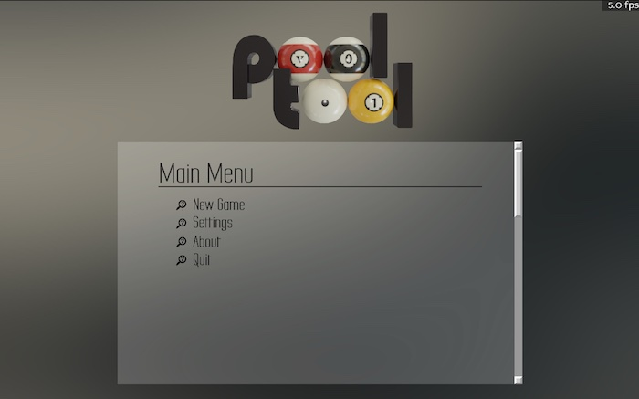
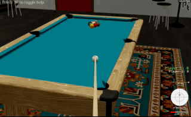
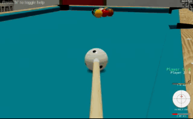
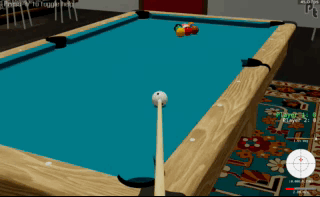
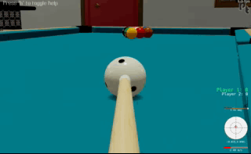
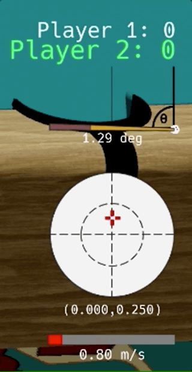
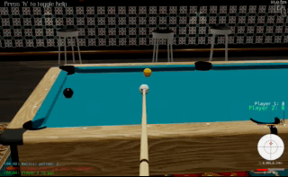
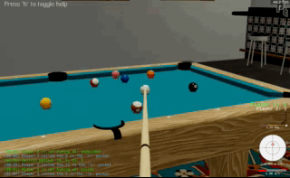

# The Interface

## From the command line

The interface (GUI) can be accessed from the command line:

```bash
run-pooltool
```

This will produce the following window:



Select [*New Game*] → [*Play now*]. Or, you can just press *n* on your keyboard.

The first thing you should do is press *h* to toggle some brief instructions. They are pretty bare, but hopefully they can get you started. Make sure you can:

1. **Rotate the camera**. Just move the mouse. The camera will rotate around the cue ball.



2. **Zoom the camera**. If you *click-and-drag* the mouse up and down, the camera zooms in and out.



3. **Pan the camera**. Normally the camera is focused on the cue ball. But whenever you **hold** *v*, you enter *view* mode. In view mode, mouse movement changes the point that the camera is focused on. This point is marked with a small red dot. To return focus to the cue ball, press *a*, which puts you back to *aim* mode.



4. **Apply english**. In aim mode or view mode, **hold** *e* to apply english. Your mouse movements will change the point at which you contact the cue ball.



5. **Change shot power**. In aim or view mode, you can control the speed of the shot by **holding** *x*. Your mouse movements up and down will control the power meter in the bottom right corner. To take a shot with the defined power, press *spacebar*. If you stroke the ball manually (see next step), controlling the power does nothing.



6. **Take a shot**. As mentioned above, you can take a shot with the currently defined power by pressing *spacebar*. But you can also manually take a shot by **holding** s when in aim or view mode, which will bring you into *stroke mode*. In stroke mode, your mouse movements control the cue stick. Pull the cue back by moving the mouse down. Then smoothly move your mouse forward until the cue hits the cue ball. Make sure you follow through. The faster you stroke, the harder the shot.



7. **Watch a shot**. The shot will unfold in front of you. This is called *shot mode*. While the shot plays, you can move the camera around with the controls I already mentioned. To pause the shot, press *space*. When paused, you can manually advance forward and backwards with *right arrow* and *left arrow*. To resume, press *space* again. You can change the speed of the replay with *up arrow* and *down arrow*. To loop the shot replay, press *r* (to end the replay looped replay, enter aim mode by pressing *a*). Finally, you can cycle through all historical shots pressing *p* (previous shot) and *n* (next shot) -- return to current shot by pressing *a*.

8. **Undo a shot**. If you’re in shot mode and would like to take the shot again, press *z* (think: undo). If you're unhappy with your shot, be sure to press *z* before the shot terminates, otherwise you won't get another chance! 

9. **Grab a ball**. In aim mode, you can **hold** *g* to enter *grab mode*. In grab mode, mouse movement moves the cue ball. Click to confirm the ball's new position, then **release** _g_. If the cue ball is not moveable (due to the game rules), holding *g* will do nothing. (_If you're playing a game where multiple balls can be moved, you'll first have to move the mouse to highlight the ball you want to move. The highlighted ball will float up and down in the air. Click once to select the highlighted ball, then mouse movement will move the ball. Click to confirm the ball's new position_).


10. **Call shot**. Some games (like 8-ball and snooker) require one to call the shot, and you _won't be able to take a shot until you call a ball and pocket_. To do this, **hold** *c*. Then move the mouse to highlight the ball you want to call (highlighted ball will float up and down). Click to confirm, and then move the mouse to highlight the pocket you want to call (ball will hover above the highlighted pocket). Click to confirm, then **release** *c*. The log message in the bottom left will confirm that you've called the ball into the pocket. **Note** Suggestions for improving the UX are welcomed.



11. **Exit**. Press *escape* to be brought back to the menu.

Make sure you play a game or two to get comfortable with the controls.

## From within python

In the next section you'll become more familiar with the Python API, however below is a minimal example for building a system, simulating it, and visualizing the results in the interface.

```python
import pooltool as pt
system = pt.System.example()
pt.simulate(system, inplace=True)
pt.show(system)
```

Once a shot is visualized in the interface, all of the controls related to camera movement and animation control are applicable. If a multisystem is being visualized, different shots can be toggled by pressing *n* (next) and *p* (previous).

## Next

Next, you'll write a small Python script that simulates a pool shot and visualizes the results in the interface.

