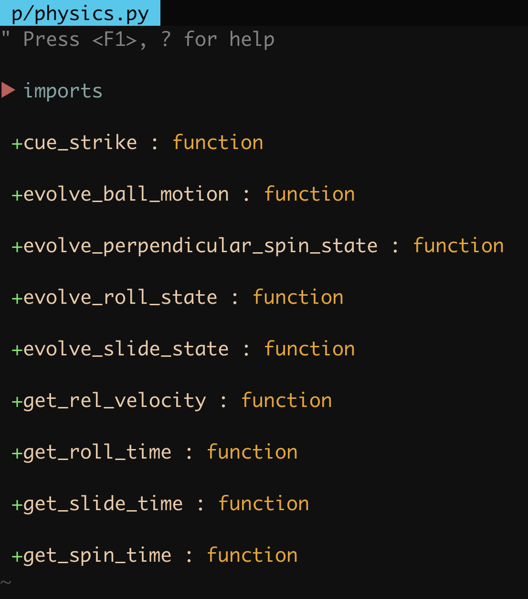
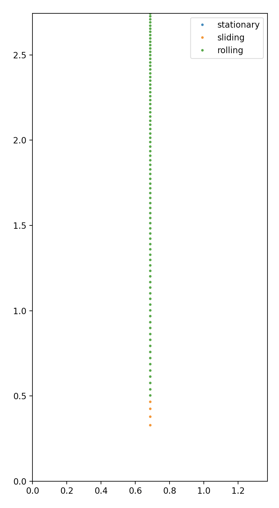
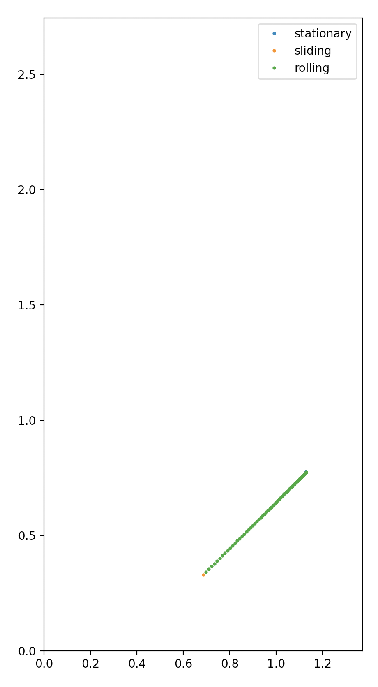
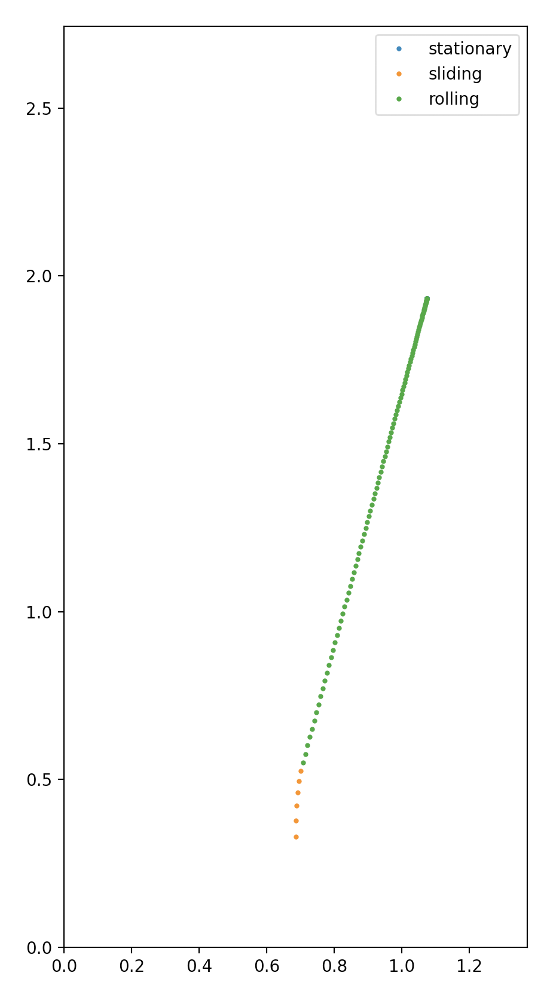
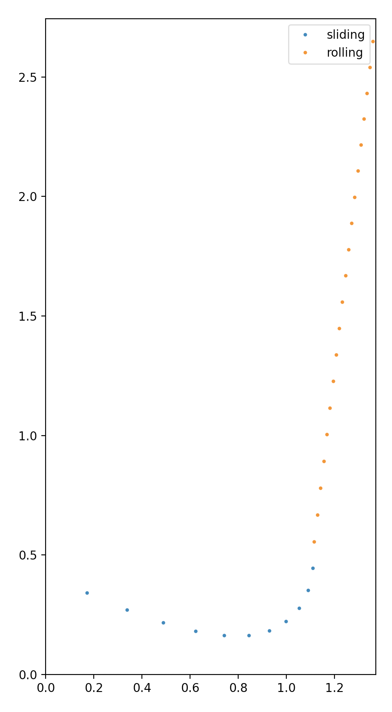

# Starting a massive project is hard

Self-motivated projects are amazing. You get to create something limited only by your imagination.
You decide what to work on and determine for yourself what is worth your time. No one tells you what
to do and there are no deadlines. There are no job performance reviews to stress about. You can work
at home, in a coffee shop, or in your underwear.

Basically, you're in charge of yourself, which is also why self-motivated projects are hard. Usually
there is some grandiose vision of what you want to achieve, and very little thought has went into
how that can be built from nothing. There are many details to work out, so many decisions to make,
and each of them could have crucial consequences on the quality of my code. How am I going to
visualize? Which graphics engine should I use? Should I write my own physics or does a physics
engine already exist. Can I assume balls are all the same size/mass? Will I pre-bake the table
geometry or allow tables to be procedurally made with arbitrary shapes and pocket locations? How
should my directory structure be laid out? How does my initial feature set dictate my code
structure? What features will I want in 6 months that my code structure does not allow for?

There is a saying that if one "_cannot see the forest for the trees_", they lack the perspective
required to see the big picture. The idea is that one can walk up to each tree and comprehend it,
but cannot see the larger pattern that is the forest. In contrast to this proverb, I would argue
that starting a large project is like being able to see the forest, but unable to see the trees it
is composed of. Your vision is the forest: a product of the entire thing. For me, it is the pool
simulation. It looks like ShootersPool, except it's even better and the physics are more realistic
and there is an editor mode where you can advance one frame at a time with a dynamic inspection page
to analyze each balls state. But I can't yet see the trees that create this vision. And I think that
is basically why most self-motivated projects do not survive to product launch. It's too hard to
even start, especially when you're by yourself. There isn't a team dedicated to the physics engine,
another for graphics, and another for the user interface. It's just you, alone. At first I found
this immobilizing, that's why I sat on this project for so many years. But the hardest parts are the
first 2% and the last 20% and sometimes to get started you just gotta start shitting onto your
keyboard.

## The first tree: Creating a bare-bones code structure

I sat on what the best way to start and decided that I would create 2 modules that symbolize a
philosophical separation of responsibility. These modules are called `engine.py` and `physics.py`.
The idea is that `engine.py` would hold in memory all the complex object structures the playing
surface, pockets, cushions, and each ball. Each of these object structures would be represented by a
class. For example, the cue stick is held in a `Cue` class that looks like this:

```python
class Cue(object):
    def __init__(self, M=psim.M, brand=None):
        self.M = M
        self.brand = brand


    def strike(self, ball, V0, phi, theta, a, b):
        v_T, w_T = physics.cue_strike(ball.m, self.M, ball.R, V0, phi, theta, a, b)

        ball.rvw[1] = v_T
        ball.rvw[2] = w_T
        ball.s = 2
```

Right now this class is just 2 attributes and a method, but this structure will grow over time and
become increasingly complex. So the role of `engine.py` is to control the simulation through the
modification of these complex objects. But whenever `engine.py` encounters something that requires
physics, it delegates _all_ responsibility to `physics.py`. Let me reiterate: `engine.py` does zero
physics. This separation between Church and State has a bit of foresight in mind: Eventually I plan
on making all physics-based number crunching a hell of a lot faster with
[Numba](http://numba.pydata.org/). But Numba does not know how to work with the complex custom
objects like `Cue` or `Ball` that `engine.py` has been designed to deal with. Numba expects
numerical objects like floats and `numpy` arrays. And that fits perfectly with physics calculations,
because parameters of physics equations are always primitive physical quantities like mass, angular
momentum, radius, velocity, etc. which are expressed as vectors and floats.

The delegation of responsibility I'm talking about can be seen in the `Cue` class above. There is a
method called `strike`. Calling this method from within `engine.py` marks the start of the
simulation, since that's how every shot starts: by striking a ball with your cue stick. As you can
see, `strike` takes as its main argument `ball`, which is a complex object type containing
information about the mass, position, velocity, angular momentum, radius, and potentially much more
information about a ball. This is in line with the responsibility of `engine,py`--handling complex object types.
But as seen in the body of the method, the actual physics calculation is delegated to the function
`cue_strike` which resides in `physics.py`. Here is `cue_strike`:

```python
def cue_strike(m, M, R, V0, phi, theta, a, b):
    """Strike a ball
                              , - ~  ,
    ◎───────────◎         , '          ' ,
    │           │       ,             ◎    ,
    │      /    │      ,              │     ,
    │     /     │     ,               │ b    ,
    ◎    / phi  ◎     ,           ────┘      ,
    │   /___    │     ,            -a        ,
    │           │      ,                    ,
    │           │       ,                  ,
    ◎───────────◎         ,               '
      bottom rail           ' - , _ , - 
                     ______________________________
                              playing surface
    Parameters
    ==========

    m : positive float
        ball mass

    M : positive float
        cue mass

    R : positive, float
        ball radius

    V0 : positive float
        What initial velocity does the cue strike the ball?

    phi : float (degrees)
        The direction you strike the ball in relation to the bottom rail

    theta : float (degrees)
        How elevated is the cue from the playing surface, in degrees?

    a : float
        How much side english should be put on? -1 being rightmost side of ball, +1 being
        leftmost side of ball

    b : float
        How much vertical english should be put on? -1 being bottom-most side of ball, +1 being
        topmost side of ball
    """

    a *= R
    b *= R

    phi *= np.pi/180
    theta *= np.pi/180

    I = 2/5 * m * R**2

    c = np.sqrt(R**2 - a**2 - b**2)

    # Calculate impact force F
    numerator = 2 * M * V0 # In Leckie & Greenspan, the mass term in numerator is ball mass,
                           # which seems wrong. See https://billiards.colostate.edu/faq/cue-tip/force/
    temp = a**2 + (b*np.cos(theta))**2 + (c*np.cos(theta))**2 - 2*b*c*np.cos(theta)*np.sin(theta)
    denominator = 1 + m/M + 5/2/R**2 * temp
    F = numerator/denominator

    # 3D FIXME
    # v_B = -F/m * np.array([0, np.cos(theta), np.sin(theta)])
    v_B = -F/m * np.array([0, np.cos(theta), 0])
    w_B = -F/I * np.array([c*np.sin(theta) - b*np.cos(theta), -a*np.sin(theta), a*np.cos(theta)])

    # Rotate to table reference
    rot_angle = phi + np.pi/2
    v_T = utils.coordinate_rotation(v_B, rot_angle)
    w_T = utils.coordinate_rotation(w_B, rot_angle)

    return v_T, w_T
```

You can see in the docstring that only numerical inputs are expected. As such, in the body of
`Cue.strike`, the necessary physical attributes stored in `ball` are unpacked and passed to
`physics.cue_strike`.

With that philosophy in mind, I created `Ball`, `Table`, and `Cue` objects to be handled by `engine.py`, and I transcribed the mathematics
referenced by Willie and Greenspan into code that I placed in a file called `physics.py`.



## The second tree: Simulating the trajectory of a ball struck by a cue

My first goal was to visualize the trajectory of a ball that has been struck with a cue. With the
necessary physics in order, all there is to do is initiate the `Ball`, `Table` and `Cue` objects,
call `Cue.strike`, and then evolve the ball motion in small timesteps. If the ball is in a sliding
state, it's state variables should be evolved according to `physics.evolve_slide_state` and if
rolling, it's state variables should be evolved according to `physics.evolve_roll_state`.

Since I have no good visualization framework yet, I just made a series of plots where x and y are the
coordinates of the table and the ball's position is plotted at each point in time. After mucn
debugging, I got something that looks to work. Let's consider 4 different shots.

### A straight shot down the table

Consult with the above docstring for a detailed look at what the parameters mean.

First is a center-ball straight down the table with low velocity:

```python
self.cue.strike(
    ball = self.balls['cue'],
    V0 = 0.6,
    phi = 90,
    theta = 0,
    a = 0.0,
    b = 0.0,
)
```



Since ball has no initial spin but is thrust into motion, it is intially sliding against the cloth.
The frictional force applies a torque that quickly equilibrates to create an angular velocity that
matches the center of mass speed of the ball. The decreased spacing between points indicates the
ball is slowing down, but was hit too hard to come to rest, There is no interaction with the cushion
so the ball rolls past the end of the table.

### A softer shot at 45 degrees with top spin

Now, I hit a similar shot but softer and at $45 \deg$ instead of 90. Instead of a center ball hit, I
hit the ball $2/5 R$ above center, where $R$ is the ball radius. This is a "sweet spot", where the
induced spin exactly matches the center of mass velocity. The ball therefore avoids sliding on the
table and immediately rolls, independent of the cue striking velocity. Read more about this physical oddity
[here](https://www.real-world-physics-problems.com/physics-of-billiards.html) (search for "sweet
spot").

```python
self.cue.strike(
    ball = self.balls['cue'],
    V0 = 0.2,
    phi = 45,
    theta = 0,
    a = 0.0,
    b = 0.4,
)
```



### A slight massé

This is a common shot to hit the object ball by bending the cue ball _around_ another ball. Here is
the legend Efren Rayes doing a whole bunch of them:

[](https://www.youtube.com/watch?v=OEQvcGljLXI "Efren Masse")

To achieve this effect, I strike down on the cue ball and apply a sizable amount of right=hand
spin:

```python
self.cue.strike(
    ball = self.balls['cue'],
    V0 = 0.6,
    phi = 90,
    theta = 20,
    a = -0.5,
    b = 0.0,
)
```



You may be interested to know that during the sliding state, the trajectory takes the form of a
parabola. Once it transitions into the rolling state, it becomes linear.

### A huge massé

Let's apply insane levels of masse, like this guy:

[](https://www.youtube.com/watch?v=t_ms6KjSoS8 "Florian Kohler")

Specifically, I tried to tune the parameters to remake the shot at 0:30

```python
self.cue.strike(
    ball = self.balls['cue'],
    V0 = 2.8,
    phi = 335,
    theta = 55,
    a = 0.5,
    b = -0.0,
)
```



The paths loom pretty identical to me, but I don't think I found a unique solution. I'm sure that
mine has more speed, a lower $\theta$ value, and who even knows about how the friction forces of the
tables match. Regardless, this is really promising!

## Next time

Next time I'm going to talk about how I developed a visualization of pool shots using
[pygame](https://www.pygame.org/news).
