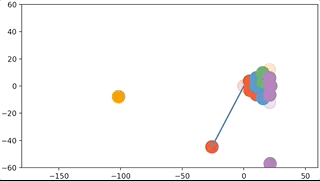

# Introduction

## Disclaimer

I'm going to talk about pool, physics, math, softare, video game design, 3D modelling, and a bunch
of things that this project has led me to. But I am not pro pool player, physicist, mathematician,
software developer, video game designer, Blender guru, or anything. So much of what I say may be
misinformative, or even rub experts the wrong way. My apologies in advance for when such instances
inevitably arise.

## Motivation

Seven years ago (2013) I was an in undergraduate math class called "Non-linear Dynamical Systems and
Chaos" taught by Dr. Anthony Quas at the Univerity of Victoria. Our final project was to investigate
a chaotic system. Adam Paul, a good friend of mine, and I decided we would work on the same project.
Since we would regularly ditch working on class assignments to instead play pool at the on-campus
pub, it seemed natural to pick pool as our chaotic system.
[Chaos](https://en.wikipedia.org/wiki/Chaos_theory) is loosely speaking defined
as a deterministic (non-random) system that exhibits extreme sensitivity to initial conditions, and so we
figured the pool break perfectly fit this description: the balls are governed by non-random and some
would argue even simplistic Newtonian physics, yet each break outcome appears unique and
irreproducible (unless you're Shane Van Boening). Ignoring variability in the cue ball velocity,
this implies that the vastness of break outcomes are determined by the milli- or maybe even
micro-meter pertubations in ball spacings in a given rack. To study this, we decided would create a
physics simulation in Python that simulated the break.

It kind of sounds like I'm chalking us up to having accomplished something amazing, however I would
like to assure you our accomplishments were far from impressive. From a physics standpoint, our model was very
skeletal. Every collision was instantaneous and elastic, and the trajectories were restricted to 2D.
We applied conservation of momentum and energy, and voila, that was our physics. From an
implementation standpoint, things were also lackluster. I think showing the product of our efforts
is in order:

It leaves much to be desired.

1. It doesn't look real
2. Physics is oversimplified
3. The code is hot garbage
4. Visualization capabilities are bad
5. 2D

Because of these shortcomings, this project kind of sat in the back of my head for years as
unfinished business. Time passed, I got more invested in pool, bought my own table, joined a pool
league. Concurrently, I started a PhD at the University of Chicago doing computational biology, and
developed considerably as a programmer due to my line of research and contributions to the open
source software platform [anvi'o](https://github.com/merenlab/anvio). Then the COVID-19 pandemic
struck and I realized I needed something other than work to keep me stimulated during quarantine.
That's when I decided to undertake this project which very loosely has the _modus operandi_ of: "_Do
something better than your show-and-tell project from 7 years ago._"
