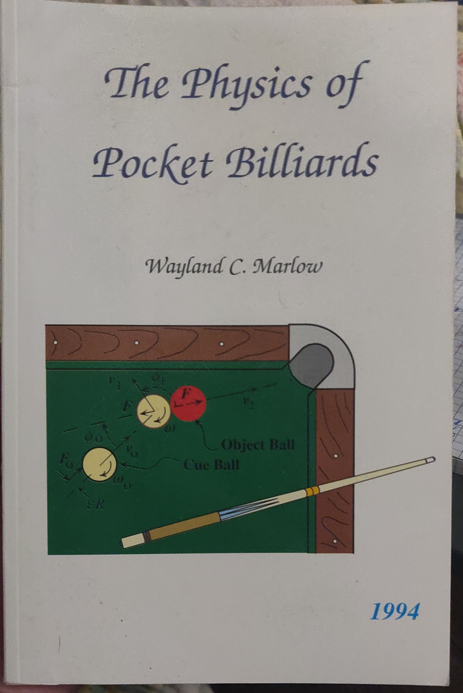

# Introduction

## Disclaimer

I'm going to talk about pool, physics, math, softare, video game design, 3D modelling, and a bunch
of things that this project has led me to. But I am not pro pool player, physicist, mathematician,
software developer, video game designer, Blender guru, or anything. So much of what I say may be
misinformative, or even rub experts the wrong way. My apologies in advance for when such instances
inevitably arise.

## Motivation

Seven years ago (2013) I was an in undergraduate math class called "_Non-linear Dynamical Systems and
Chaos_" taught by Dr. Anthony Quas at the Univerity of Victoria. Our final project was to investigate
a chaotic system. Adam Paul, a good friend of mine, and I decided we would work on the same project.
Since we would regularly ditch working on class assignments to instead play pool at the on-campus
pub, it seemed natural to pick pool as our chaotic system.
[Chaos](https://en.wikipedia.org/wiki/Chaos_theory) is loosely speaking defined
as a deterministic (non-random) system that exhibits extreme sensitivity to initial conditions, and so we
figured the pool break perfectly fit this description: the balls are governed by non-random and some
would argue even simplistic Newtonian physics, yet each break outcome appears unique and
irreproducible (unless you're Shane Van Boening). Ignoring variability in the cue ball velocity,
this implies that the vastness of break outcomes are determined by the milli- or maybe even
micro-meter pertubations in ball spacings in a given rack. To study this, we decided would create a
physics simulation in Python that simulated the break.

It kind of sounds like I'm chalking us up to having accomplished something amazing, however I would
like to assure you our accomplishments were far from impressive. From a physics standpoint, our model was very
skeletal. Every collision was instantaneous and elastic, and the trajectories were restricted to 2D.
We applied conservation of momentum and energy, and voila, that was our physics. From an
implementation standpoint, we used a discrete time integration approach with a constant time step, which is
computationally very ineffecient. Algorithm aside, the program exhibits zero respect for the art of programming
and is so poorly implemented with hardcoded variables and spaghetti logic that no one in their right
mind should lay eyes on it. I think showing the product of our efforts is in order:

Not exactly what you would call realistic, or pretty. The GIF has a shitty black bar on the
bottom, which I find deserving. The [quality of the code](media/2013_project.py) is even worse than
the animation.

Because of the drastic potential for improvement, this project kind of sat in the back of my head for years as
unfinished business. Time passed, I got more invested in pool, bought my own table, joined a pool
league. Concurrently, I started a PhD at the University of Chicago doing computational biology, and
developed considerably as a programmer due to my line of research. Then the COVID-19 pandemic
struck and I realized I needed something other than work to keep me stimulated during quarantine.
That's when I decided to undertake this project.

## Goal

With all that said, the goal of this project is to make as realistic a pool physics engine as
possible. I don't want to project too far, but after that, I think any of these would be suitable
next steps:

1. make a game
2. a GUI to explore pool shots
3. an AI pool player

# Getting started

I wanted to tackle the following questions before starting this journey:

1. What kind physics has been done on billiards?
2. How do state of the art pool simulators work?

So I did some research on both these topics...

## What kind physics has been done on billiards?

The thing about pool is that its pretty old. This piece of art, which please God let it be famous
for no other reason than it representing the first historical depiction of billiards, dates back to
1674.

Coincidentally, at exactly this point in history Isaac Newton would have been busy inventing
calculus, his self-titled Newtonian physics, and a universal theory of gravitation that wholly
explained the previously disparate phenomena of tides, why things fall, and the motions of celestial
bodies. His contributions to science would spark a revolution in the physical sciences more
illustrious than anyone before him, and arguably since him. But most importantly by far, Newton's
work would enable the theoretical treatment of the game of billiards, and as such, the game has been
studied for at least 200 years.

As a result of its long history, the theoretical treatment of billiards has been sufficiently solved
for most scenarios: the trajectories of the balls and their interaction with the cloth, the
collision of one ball with another, as well as with the cushion. The jury is still out on the finer
details of many of these interactions, and some treatments are less accurate than others (treatments
of ball-cushion interactions tend to make oversimplifying assumptions due to the compressible
geometry of cushions throughout the interaction), but each of these individual scenarios have
analytical solutions (no discrete time integration).

This is great, because I don't have to get my hands dirty in physics, something I was hoping to
avoid as much as possible. Nevertheless, as a reference source, I decided to pick up the
non-exhaustive but heavily referenced "modern day" treatment of billiards, "_The
Physics of Pocket Billiards_" by Wayland C. Marlow. Here is it's modest cover:

## How do state of the art pool simulators work?

The shining greats in terms of physics realism are without a doubt and ShootersPool Billiards
Simulation and Virtual Pool 4. Look at the pure beauty of this ShootersPool demo:

Both from a graphics and physics perspective, this appears very real. The only physical inaccuracy I
can spot is as balls are entering the pockets they seem to undergo a pre-baked animation rather than
interacting genuinely with the pocket. Here is the trailer for Virtual Pool 4:

Less impressive graphics and no slo-mo shots to scrutinize in careful detail, but having played the
game myself, I can attest to the quality of the physics.

So how do these pool simulators actually work? I have no idea, and that is understandably by design.
I wasn't able to gain any insight into how much money these companies are making from pool games but
let me know if you have any estimates. Regardless, both of these projects have been monetized and
have reason to keep their algorithms to themselves.

So the bottom line is that I have no idea what's going on under the hood in these games, but by
doing some research I think all pool simulators are going to fall under these two umbrellas:
discrete time integration, or event-based integration. So let's talk about these.

## Pool simulator research

I never had any intention of developing this from scratch. To that end, I started researching
academical papers on pool simulation, which are surprisingly numerous. Usually, the research is
motivated by developing a realistic/fast physics engine as a necessary precursor to creating a robot
that can play pool:

Another application is to study game theory and make a billiards AI. In any case, during my literature
review I stumbled upon the work of Leckie and Greenspan entitled [An Event-Based Pool Physics
Simulator](https://link.springer.com/chapter/10.1007/11922155_19). A free pre-print of this
publication is available
[here](http://citeseerx.ist.psu.edu/viewdoc/download?doi=10.1.1.89.4627&rep=rep1&type=pdf). This is
a pretty groundbreaking paper, because they develop a method to solve the trajectories of pool balls
that avoid discrete time integration, the most common way to evolve many-body systems through time.
To contextualize their algorithm, I should first talk more about discrete time integration.

### Discrete Time Integration

Simply put, discrete time integration works by advancing the state forward in small time steps,
let's say an amount $dt$. At each timepoint $t$, the forces governing the motions are calculated,
and then all of the bodies' states (positions, velocities, etc.) are advanced to $t + dt$, under the
assumption that the forces are constant over that duration. It is critical that these time steps are
small enough, otherwise the evolution will be physically inaccurate. To see why, consider the example of
one ball hitting another:

Let's say the goal is to determine the collision time as accurately as possible. So Ball A on the
bottom is moving with a constant velocity towards Ball B. At each timestep, it is checked whether
the collision has occurred, which is done checking if the balls intersect. In the first panel a
large timestep is chosen, and we can see that the collision is detected well after the balls first
intersect. By choosing a smaller timestep like in the second panel we see a more accurate
determination of the time of collision.

So the smaller the time step, the more accurate this assumption is. But this comes at the cost of
subdividing your simulation time into smaller and smaller timesteps, each which come with increased
cost of computation. This can become brutal when dealing with pool simulations. Ball speeds commonly
reach $10$ m/s, and a reasonable requirement for realism is that 2 balls should never intersect more
than $1/100$th of a ball radius ($0.3$ mm). The required timestep for this level of realism is then
$30$ microseconds. If the time from the cue strike to the last ball rolling is 10 seconds, that is
$30,000$ time steps in total for one shot. If the level of realism is $1/1000$th a ball radius, that
is $300,000$ time steps. Yikes.

The problem with this is all of the wasted computation... I don't need $30$ microsecond time steps
when all of the balls are far apart and barley moving. It is only really in select scenarios, such a
pool break, that realism demands such miniscule time steps. So a smart numerical integration
scheme would be to cut down on the number of time steps by making them
[adaptive](https://en.wikipedia.org/wiki/Adaptive_step_size) depending on the state of the system.
There are an infinite number of ways you could develop heuristics for an adaptive time stepper, that
may be based on the distances between balls (if they are far apart, increase the time step), or
based on velocities (if they are moving fast, decrease the time step). I'm not even going to go
there because the possibilities are endless, although I am convinced that if Virtual Pool 4 or
ShootersPool are using discrete time integration, they are using adaptive time stepping.

## Event-based Simulation

Even with adaptive time stepping, there is going to be wasted computation when viewed
retrospectively. So ideally, you'd want to avoid it altogether. In the example of the colliding
balls, what if we could predict when the collision happens by using knowledge of their positions and
velocities? After all, it looks plainly obvious that they are going to collide, so why waste our time
advancing with so many time steps? Let's add some variables to the picture:

FIXME

$R$ is the ball radii, $v$ is the speed of the ball, and $d$ is the distance they are from collision
the collision state. If we assume that the Ball A moves with constant velocity, the time until
collision is quiter simply $\tau = d/v$.

This has some serious advantages over time integration. First, it is computationally much more
efficient. It was just one instance of arithmetic: $d/v$. Second, it is not subject to
discretization error. In the discrete time integration method above, the collision is detected
_after_ it happened since the collision is detected by seeing if the balls are intersecting. But if
they are intersecting, they already collided! This is what I'm calling discretization error. In
contrast, there is no error in $d/v$, save for floating point error.

This is actually a huge deal from the perspective of simulation, but it requires mathematical
formulas for the positions of the bodies as a function of time, and in most multi-body systems, this
is too much to ask. For example, the system of 3 planets exhibiting gravitational forces on one
another has no analytical mathematical formula for the positions as a function of time. Look at how
complex the solution becomes:

FIXME (embed and hyperlink goes to wiki)
https://en.wikipedia.org/wiki/Three-body_problem#/media/File:Three-body_Problem_Animation_with_COM.gif

In this case, discrete numerical integration is a necessity. So is numerical integration a necessity
for pool physics? As with all physics, it depends how realistic you want to be, but mathematical
functions exist to describe ball trajectories under assumptions that are pretty much physically
accurate. They are much more complex than the toy example above, but they exist.
